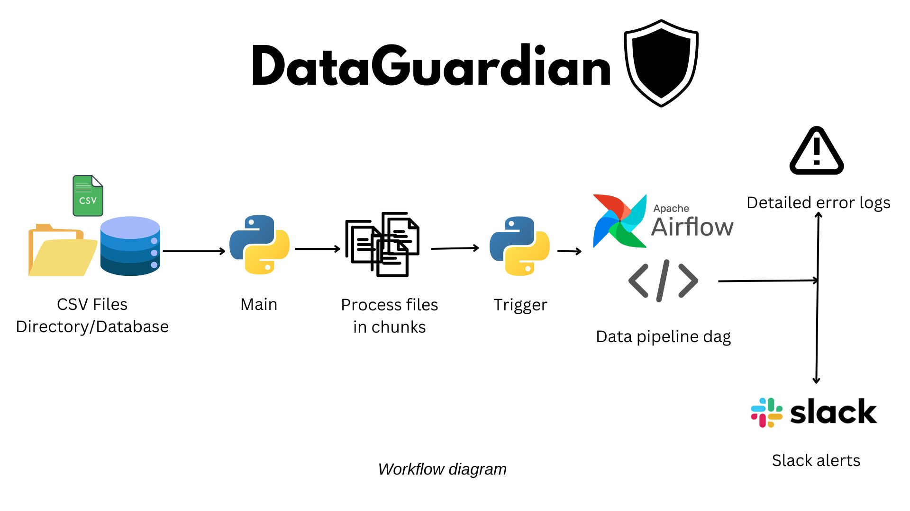

# Data Guardian

## Project Overview

Data Guardian is a data validation and transformation pipeline built using Apache Airflow. This project aims to process large CSV files by validating, cleaning, transforming the data, and then notifying the team via Slack about the success or failure of the data processing pipeline. Any errors encountered during the process are logged for review.

## Description

Data Guardian is designed to handle the following tasks:

1. **Load Data**: Read CSV files from a specified directory.
2. **Remove Unwanted Columns**: Filter out unnecessary columns from the dataset.
3. **Validate Data**: Check for missing values and ensure correct data types.
4. **Generate New Columns**: Add new columns based on existing data.
5. **Rename Columns**: Rename columns for better readability and usability.
6. **Write Output**: Save the processed data back to a CSV file.
7. **Notifications**: Send Slack notifications on DAG success or failure.
8. **Error Logging**: Log any errors encountered during the process.

## Problem Statement

Processing large datasets manually is time-consuming and prone to errors. The primary problem this project aims to solve is to automate the data validation and transformation process, ensuring data integrity and providing real-time notifications of the pipeline status. This helps in maintaining data quality and speeds up the data processing workflow.

## Why Apache Airflow?

Apache Airflow is chosen for this project because it provides a robust and scalable solution for orchestrating complex workflows. Airflow's capabilities include:

- **Task Scheduling**: Schedule and monitor the execution of tasks.
- **Task Dependencies**: Define dependencies between tasks to ensure proper execution order.
- **Scalability**: Handle large datasets and complex workflows efficiently.
- **Extensibility**: Integrate with various tools and services.
- **Monitoring and Logging**: Built-in monitoring and logging capabilities to track the status of workflows.

## Features and Improvements

Data Guardian can be further enhanced by adding more features and improvements, such as:

- **Data Enrichment**: Integrate external data sources to enrich the dataset.
- **Advanced Validation**: Implement more complex validation rules.
- **Automated Scaling**: Automatically scale resources based on the workload.
- **Machine Learning Integration**: Integrate machine learning models for predictive analysis.
- **Enhanced Notifications**: Customize notifications for different types of events and thresholds.

By extending the project with these features, users can customize Data Guardian to fit their specific needs and use cases.

---

